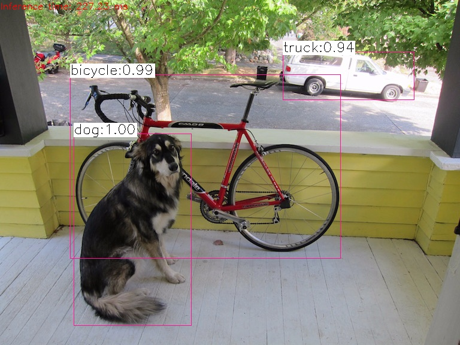

1.下载或者clone文件，进入命令行运行getModels.sh 获取模型参数。
```bash
git cloen https://github.com/JimmyHHua/yolov3-with-opencv.git
cd yolov3-with-opencv
./getModels.sh
```
2.针对图片识别或者视频检测，运行相关命令如下：
```bash
# command for test:
# 1. for a single image:
  python object_detection_yolo.py --image=bird.jpg

# 2. for a video file:
  python3 object_detection_yolo.py --video=wall.mp4

# 3. for webcam:
  python3 object_detection_yolo.py
```
3.结果如下：
- 检测单个图片：

	

- 检测视频目标：

  

  

  视频下载-->[百度云](https://pan.baidu.com/s/1o6-AuGAy2RS1I5mYStnTug)

  - 摄像头实时检测：
  >直接运行命令，系统会弹出摄像头进行检测，同时会把整个录制过程保存为 yolo_out_py.avi 文件。
